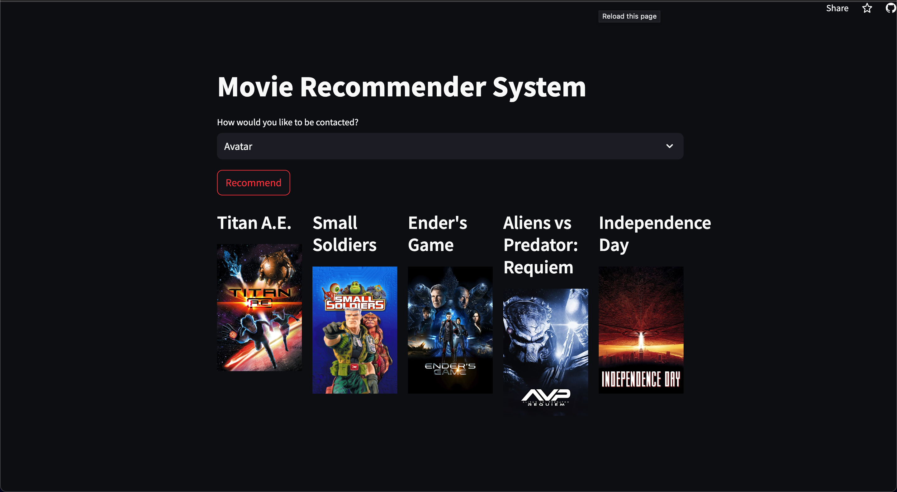

# Movie Recommender System
Project Link: [movie-recommender-system](https://nseghn67xivdv5nmn34u8m.streamlit.app/)

## Table of Contents

- [About the Project](#about-the-project)
  - [Features](#features)
  - [Tech Stack](#tech-stack)
- [Getting Started](#getting-started)
- [Contact](#contact)

## About the Project

The Movie Recommender System is a project designed to provide personalized movie recommendations based on user preferences and a dataset of 5000 movies from The Movie Database (TMDB). It employs content-based filtering, analyzing movie attributes such as genres, actors, and keywords to suggest the top 5 movies similar to a user-provided title. Additionally, the system integrates with the TMDB API to display visually engaging movie posters.

### Features

- Content-based filtering for personalized recommendations
- Utilization of a 5000-movie TMDB dataset
- Integration with the TMDB API for fetching movie posters
- Recommends the top 5 movies similar to a user-provided title
- Enhances user experience with visually appealing posters

### Tech Stack

- Programming Language: Python
- Machine Learning Libraries: scikit-learn, TensorFlow, Keras
- Web Development: StreamLit
- Data Processing: Pandas, NumPy
- API Integration: TMDB API

## Getting Started

1. Enter a movie title in the search bar.
2. Receive personalized recommendations and view movie posters.

## Contact

Your Name - harshit2977@gmail.com
LinkedIn -  [LinkedIn](https://www.linkedin.com/in/harshit-patidar-874985220/)

